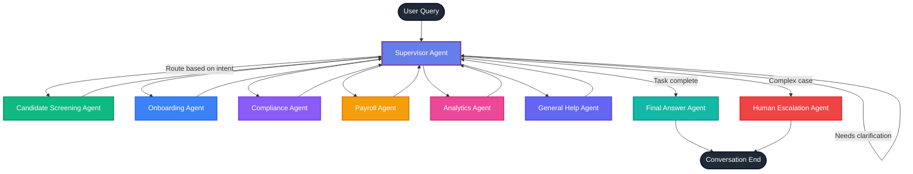

# Hifadhi Multi-Agent Workflow Diagram

## Workflow Description

This diagram represents the complete conversation flow in the Hifadhi multi-agent system.

### Flow Explanation:

1. **User Query** enters the system through the Supervisor Agent
2. **Supervisor Agent** analyzes intent and routes to appropriate specialist
3. **Specialist Agents** execute their tasks and return to Supervisor
4. **Supervisor** continues routing until task is complete
5. **Final Answer Agent** polishes the response before ending
6. **Human Escalation** occurs for complex cases

### Agent Responsibilities:

- **Candidate Screening Agent**: Application status, profiles, interviews
- **Onboarding Agent**: Task tracking, document collection
- **Compliance Agent**: KRA/NSSF/NHIF verification
- **Payroll Agent**: M-Pesa payments, salary processing
- **Analytics Agent**: Hiring metrics and insights
- **General Help Agent**: FAQ responses using RAG
